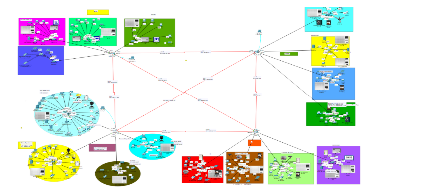

# MapleTech Network Design

## Project Overview
This project implements a network solution for MapleTech, connecting their offices in Kuala Lumpur, Penang, Ipoh, and Melacca. The design provides reliable connectivity, security, and supports essential network services.

## Network Design
- **Topology**: Connects all four office locations with appropriate routers and switches
- **IP Addressing**: Each location has its own subnet with logical organization
- **Services**: Includes DNS, DHCP, web servers, file servers, and email servers

## Key Features
- Secure connections between all office locations
- Separate network segments for different departments
- Support for IoT devices
- Static routing for efficient packet delivery
- Server rooms at each location for critical services

## Setup Instructions
1. Install Cisco Packet Tracer
2. Open the `MapleTech_Network.pkt` file
3. Explore the network design
4. Use simulation mode to test connectivity

## Contributors
- @Kashave: Kuala Lumpur Branch
- @Chen Xiang Bin : Penang Branch
- @Koh Zhu Yen: Ipoh Branch
- @Sunnahboy: Melacca Branch

## Find full documenation here:
### [📄 View Full Documentation](https://docs.google.com/document/d/1Wxw2ekEAkwNPyn7sajcsSqYGrCi-eXx10ZyZQizTWng/edit?usp=sharing)

---
* Networking course at Asia Pacific University*
